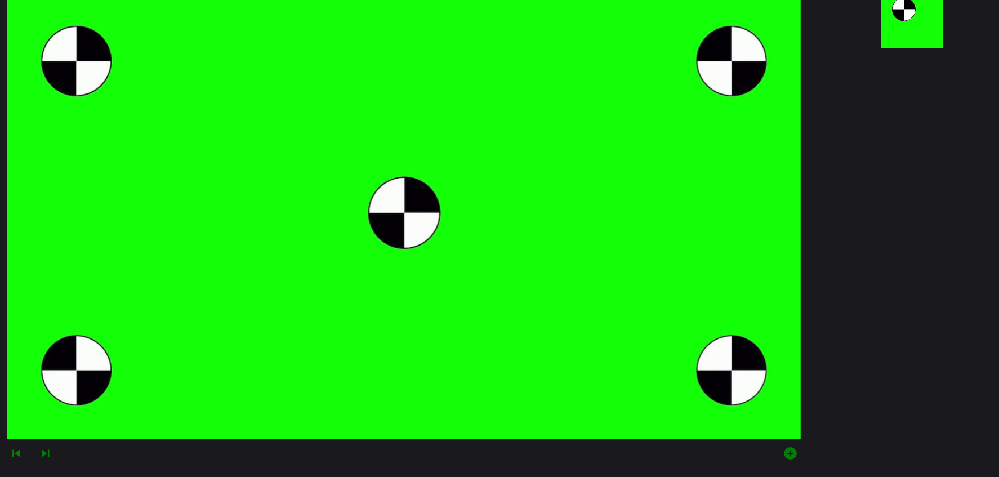

# React based Preview of ROI-Tracking Points

As part of my advanced practical at quality-match I was tasked with creating an React Component, that enables the creation of tracks with individual points and a preview for the markers. Once a specific track is selected, show a preview of the area specified by the marker. This preview should update on movement, resize, and obviously whenever there is a change of the currently displayed frame.

### 1.) Creating a preview

My first approach for creating a preview is using 2 "konva-canvas" one that shows the full picture while it also allows for the creation of markers. And one canvas, that shows a cropped version of the picture defined by the selected marker, that is scaled to match the size of the preview window.

Added a change to the functionality, you now need to press a button to be able to add a new marker. This makes it less likely to accidentally add markers.
Also now the system can accept any image and display it in both the main player and the preview. Additionally I found out about the onDrag function and onTransform, so now the preview updates in Real-Time, rather than after the change to the marker is completed.

TODO: allow deletion of markers (probably done by using the rightclick menu, though i am still brainstorming there)

### 2.) Multiple pictures

Given the name of the Picture as a String the player can now switch the pictures at runtime. now i need a good way of converting a video to a list of images be able to navigate to them through the forward and backward buttons. This should then display the appropriate marker locations for the picture.

Also Marker creation should cycle through every picture, so every Marker (and the list of positions) is completed before you create a new Marker.
