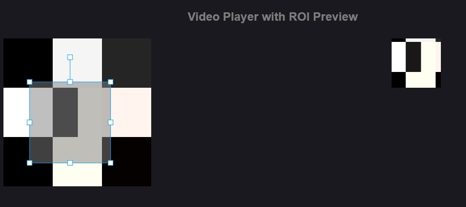

# React based Preview of ROI-Tracking Points

As part of my advanced practical at quality-match I was tasked with creating an React Component, that enables the creation of tracks with individual points and a preview for the markers. Once a specific track is selected, show a preview of the area specified by the marker. This preview should update on movement, resize, and obviously whenever there is a change of the currently displayed frame.

### 1.) Creating a preview

My first approach for creating a preview is using 2 "konva-canvas" one that shows the full picture while it also allows for the creation of markers. And one canvas, that shows a cropped version of the picture defined by the selected marker, that is scaled to match the size of the preview window.

TODO: allow deletion of markers, create markers with a button rather than on click in empty space

### 2.) Multiple pictures
