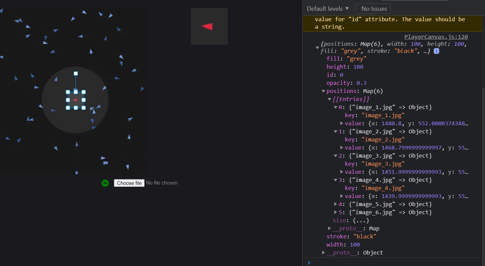

# React based Preview of ROI-Tracking Points

### Task

Implement a simple video player React component. The user can either press a play button to play the video or step through it manually with a next or a previous frame button. On the footage a point can be clicked to set a track point. Decide how to visualize the trackpoint and store the pixel position for each frame. This process can be done for each frame of the footage to create a tracking over all or at least a part of the frames. Next step is to add a track window component. Start with a fixed ROI to crop from the footage around your track point. Try to clearly separate the logic in components. Components that just display should only do that, components that process data, should only do that. If you have time and motivation left, make the ROI size adjustable and add other features you may find useful for the track-window. Make adding more than one feature track possible.

### 1. Creating a preview

My first approach for creating a preview is using 2 "konva-canvas" one that shows the full picture while it also allows for the creation of markers. And one canvas, that shows a cropped version of the picture defined by the selected marker, that is scaled to match the size of the preview window.

Added a change to the functionality, you now need to press a button to be able to add a new marker. This makes it less likely to accidentally add markers.
Also now the system can accept any image and display it in both the main player and the preview. Additionally I found out about the onDrag function and onTransform, so now the preview updates in Real-Time, rather than after the change to the marker is completed.

TODO: allow deletion of markers (probably done by using the rightclick menu, though i am still brainstorming there)

### 2. Multiple pictures

Given the name of the Picture as a String the player can now switch the pictures at runtime. now i need a good way of converting a video to a list of images be able to navigate to them through the forward and backward buttons. This should then display the appropriate marker locations for the picture.

Also Marker creation should cycle through every picture, so every Marker (and the list of positions) is completed before you create a new Marker.

Using JS Map I am now able to add new Coordinates to a marker by moving the rectangle in the new picture... sadly this is not the intended way. I am looking for a way to force a redraw, once I change the currently shown Image. All the other parts of the Code seem to be working as intended... as far as i can tell anyways.

As "Video" i am using a 2 Second clip from https://www.youtube.com/watch?v=bqtqltqcQhw& since it shows an easily trackable "boid". Currently I locally converted a video using ffmpeg but the endgame goal would be to upload a video that is being converted, and then enable the ability to track points within that video.

I also want to add a way to import and export tracks but that is for way later.

### Force a redraw

My current biggest problem is, I draw the marker layer once.. and never again. but I would like to redraw the marker layer everytime there is a change in the background picture (same goes for the preview) once i have this figured out most of the baseline for the project should be done.
